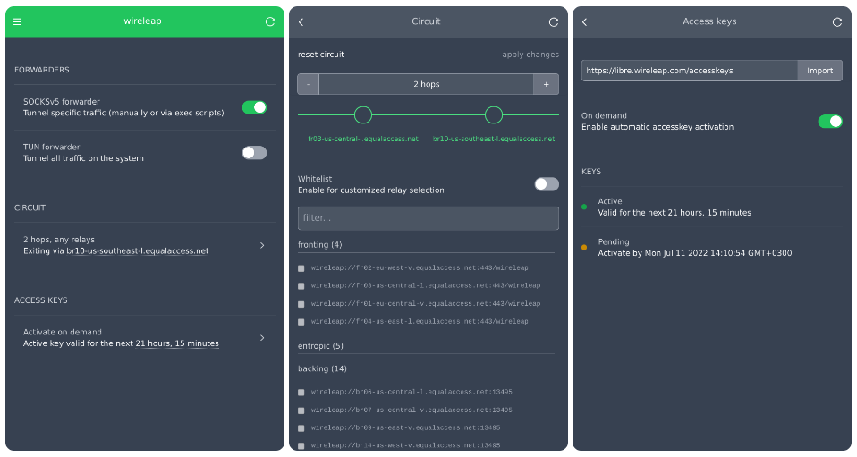

# Wireleap client webui

[Wireleap](https://wireleap.com) is a decentralized communications
protocol and open-source software designed with the goal of providing
unrestricted access to the internet from anywhere.

The Wireleap client software is used to tunnel traffic through
servers running Wireleap relay software.

This repository provides a web interface created with AlpineJS and
TailwindCSS for the [Wireleap client](https://github.com/wireleap/client)
utilizing the [client API](https://wireleap.com/docs/client-api/).

> Important: This should be considered pre-release status.



## Installation

The easiest way to install is by using `git`:

```shell
# assuming the wireleap client is installed, populate the webroot
cd $HOME/wireleap
git clone git@github.com:wireleap/client-webui.git ./webroot

# start controller if not already running
./wireleap start

# upgrade (when needed)
cd $HOME/wireleap/webroot
git pull origin master
```

Alternatively, if you don't have `git` installed, download the 
[master.zip](https://github.com/wireleap/client-webui/archive/refs/heads/master.zip)
and unpack the contents of the `client-webui-master` folder into
`$HOME/wireleap/webroot/`.

Once the webroot is populated, browse to: [http://127.0.0.1:13490](http://127.0.0.1:13490)

## Development

```shell
tailwindcss -i index.css -o build/index.css [--watch]
```

## License

The MIT License (MIT)

